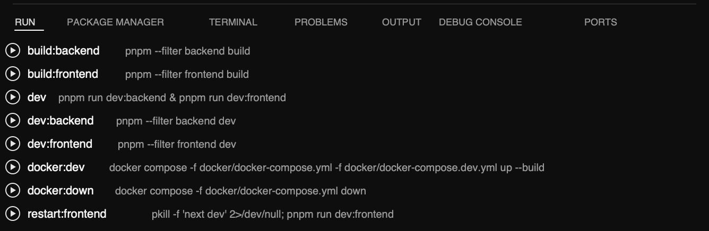

# Better Npm Button

Better Npm Button adds a dedicated `Run` view to the VS Code Activity Bar so you can discover and run `package.json` scripts without switching back to the explorer or terminal first.

## Screenshot



## Why It Exists

VS Code already exposes npm scripts in a few places, but the experience is easy to miss and gets noisy in multi-package workspaces. Better Npm Button keeps script execution in one predictable sidebar with a small set of controls:

- a dedicated Activity Bar entry
- root-only or whole-workspace package discovery
- one-click script execution
- rerun-last and refresh actions
- automatic `npm` / `pnpm` / `yarn` / `bun` detection

## Features

- Adds a `Run` Activity Bar container with a `Scripts` tree view
- Reads scripts from the root `package.json` or every package in the workspace
- Groups monorepo scripts by package when `runSidebar.scope` is set to `all`
- Supports `npm`, `pnpm`, `yarn`, and `bun`
- Lets you toggle a theme-aware play icon on or off
- Includes an optional button-style script UI for a more prominent run action
- Refreshes automatically when `package.json` files are created, changed, or deleted
- Supports rerunning the last script from the view title
- Renders `//` comment keys as non-runnable section headers, preserving your groupings
- Configurable sort order — original, alphabetical, or alphabetical within each section
- Pin any script to the top of the list with a hover icon; reorder pins via right-click

## Install

### From a VSIX

1. Open VS Code.
2. Open the Extensions view.
3. Open the `...` menu.
4. Select `Install from VSIX...`.
5. Choose the packaged `.vsix` file.

## Use

1. Open a folder or workspace that contains at least one `package.json`.
2. Click the `Run` icon in the Activity Bar.
3. Expand a package if needed.
4. Click a script to execute it in the integrated terminal.

Use the title bar actions in the view to:

- refresh script discovery
- rerun the last executed script

## Settings

### `runSidebar.scope`

- `root`: show scripts only from the first workspace folder root `package.json`
- `all`: scan all workspace folders and show every discovered package

### `runSidebar.showPlayIcon`

- `true`: show a play icon next to each script
- `false`: show scripts without the icon

### `runSidebar.scriptUiMode`

- `default`: keep the current compact script list
- `button`: show scripts in a more action-oriented `Run <script>` layout

### `runSidebar.packageManager`

- `auto`: detect from lockfiles
- `npm`, `pnpm`, `yarn`, `bun`: force a specific package manager

### `runSidebar.terminalMode`

- `new`: create a new terminal per run
- `reuse`: reuse one shared terminal named `Run`

### `runSidebar.focusTerminal`

- `true`: focus the terminal after starting a script
- `false`: keep focus in the sidebar

### `runSidebar.sortOrder`

- `original`: show scripts in the order they appear in `package.json` (default)
- `alphabetical`: sort all scripts A→Z
- `alphabeticalGrouped`: sort scripts A→Z within each `//` section, keeping section order intact

### Pinning scripts

Hover any script to reveal a pin icon on the right. Click it to move the script to a **Pinned** section at the top of the list. Pinned scripts show a thumbtack icon and persist across restarts.

To reorder pinned scripts, right-click a pinned script and choose **Move Up** or **Move Down**. To unpin, hover the script and click the thumbtack icon, or use the right-click menu.

### Section headers

Script keys that start with `//` are treated as non-runnable section headers. They display as label rows with no play button. Use them in your `package.json` to visually group related scripts:

```json
"scripts": {
  "//--- Build ---": "",
  "build": "tsc",
  "build:watch": "tsc --watch",
  "//--- Test ---": "",
  "test": "vitest"
}
```

## Behavior Notes

- In `root` mode, the terminal title uses the script name.
- In `all` mode, the terminal title uses `package: script`.
- In `reuse` mode, the extension recreates the shared terminal when you switch to a different package directory so the shell starts in the correct working directory.
- Automatic package-manager detection walks up from the selected package directory to the workspace root and looks for known lockfiles.

## Known Limitations

- The extension only reads `package.json` scripts. It does not parse custom task runners or shell aliases.
- `root` mode only uses the first workspace folder.
- Untrusted workspaces and virtual workspaces are not supported.

## Development

```bash
npm install
npm run compile
```

To package a local release:

```bash
npm run package:vsix
```

## Automated Publishing

This repository includes a GitHub Actions workflow at `.github/workflows/publish.yml`.
It runs when `package.json`, `package-lock.json`, or the workflow file itself changes on `main` or `master`, and it can also be started manually from the Actions tab.
Marketplace publishing only happens when the `version` field in `package.json` changed compared to the previous commit.

Before it can publish, add a GitHub repository secret named `VSCE_PAT`.
The value must be a Visual Studio Marketplace personal access token with Marketplace manage access.

Release flow:

1. Update the `version` in `package.json`.
2. Commit the release.
3. Push the commit to GitHub.

Example:

```bash
git add .
git commit -m "Release 0.2.3"
git push origin main
```

## License

MIT
