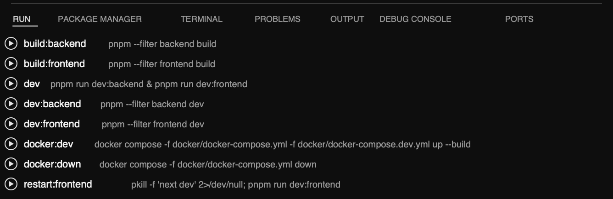

# Better Npm Button

Better Npm Button adds a dedicated `Run` view to the VS Code Activity Bar so you can discover and run `package.json` scripts without switching back to the explorer or terminal first.

## Screenshot



## Why It Exists

VS Code already exposes npm scripts in a few places, but the experience is easy to miss and gets noisy in multi-package workspaces. Better Npm Button keeps script execution in one predictable sidebar with a small set of controls:

- a dedicated Activity Bar entry
- root-only or whole-workspace package discovery
- one-click script execution
- rerun-last and refresh actions
- automatic `npm` / `pnpm` / `yarn` / `bun` detection

## Features

- Adds a `Run` Activity Bar container with a `Scripts` tree view
- Reads scripts from the root `package.json` or every package in the workspace
- Groups monorepo scripts by package when `runSidebar.scope` is set to `all`
- Supports `npm`, `pnpm`, `yarn`, and `bun`
- Lets you toggle a theme-aware play icon on or off
- Includes an optional button-style script UI for a more prominent run action
- Refreshes automatically when `package.json` files are created, changed, or deleted
- Supports rerunning the last script from the view title
- Renders `//` comment keys as non-runnable section headers, preserving your groupings
- Configurable sort order — original, alphabetical, or alphabetical within each section
- Pin any script to the top of the list with a hover icon; reorder pins via right-click
- Shows what each script does, from a `"scripts-info"` block in `package.json` — beside the name and on hover ([details](#script-info))
- Marks scripts that hit production (red cloud) or a local server (green computer), from an `env` field in `"scripts-info"`

## Install

### From a VSIX

1. Open VS Code.
2. Open the Extensions view.
3. Open the `...` menu.
4. Select `Install from VSIX...`.
5. Choose the packaged `.vsix` file.

## Use

1. Open a folder or workspace that contains at least one `package.json`.
2. Click the `Run` icon in the Activity Bar.
3. Expand a package if needed.
4. Click a script to execute it in the integrated terminal.

Use the title bar actions in the view to:

- refresh script discovery
- rerun the last executed script

## Settings

### `runSidebar.scope`

- `root`: show scripts only from the first workspace folder root `package.json`
- `all`: scan all workspace folders and show every discovered package

### `runSidebar.showPlayIcon`

- `true`: show a play icon next to each script
- `false`: show scripts without the icon

### `runSidebar.scriptUiMode`

- `default`: keep the current compact script list
- `button`: show scripts in a more action-oriented `Run <script>` layout

### `runSidebar.packageManager`

- `auto`: detect from lockfiles
- `npm`, `pnpm`, `yarn`, `bun`: force a specific package manager

### `runSidebar.terminalMode`

- `new`: create a new terminal per run
- `reuse`: reuse one shared terminal named `Run`

### `runSidebar.focusTerminal`

- `true`: focus the terminal after starting a script
- `false`: keep focus in the sidebar

### `runSidebar.scriptDescription`

What to show in grey beside each script name. See [Script info](#script-info).

- `command` (default): the script's command.
- `info`: the script's info from `"scripts-info"`. A script with no info shows its command instead, so nothing is ever blank.

Either way, hovering a script shows both its info and its command. The button in the Scripts view title bar switches between the two without opening Settings.

### `runSidebar.showEnvIcons`

- `true` (default): scripts whose `env` mentions prod or local get a red cloud or green computer icon. See [Environment icons](#script-info).
- `false`: they keep the play icon.

### `runSidebar.sortOrder`

- `original`: show scripts in the order they appear in `package.json` (default)
- `alphabetical`: sort all scripts A→Z
- `alphabeticalGrouped`: sort scripts A→Z within each `//` section, keeping section order intact

### Pinning scripts

Hover any script to reveal a pin icon on the right. Click it to move the script to a **Pinned** section at the top of the list. Pinned scripts show a thumbtack icon and persist across restarts.

To reorder pinned scripts, right-click a pinned script and choose **Move Up** or **Move Down**. To unpin, hover the script and click the thumbtack icon, or use the right-click menu.

### Section headers

Script keys that start with `//` are treated as non-runnable section headers. They display as label rows with no play button. Use them in your `package.json` to visually group related scripts:

```json
"scripts": {
  "//--- Build ---": "",
  "build": "tsc",
  "build:watch": "tsc --watch",
  "//--- Test ---": "",
  "test": "vitest"
}
```

### Script info

`package.json` has no comments, so there's nowhere to say what a script does. Add a `"scripts-info"` object next to `"scripts"`, keyed by script name, and the sidebar shows each script's info:

```json
"scripts": {
  "dev": "vite",
  "test": "vitest run",
  "release": "bash ./scripts/release.sh"
},
"scripts-info": {
  "dev": "Run the app with hot reload.",
  "test": "Run the unit tests once.",
  "release": "Publish to all users: bump version, build, upload."
}
```

npm, pnpm, yarn and bun all ignore unknown top-level keys, so this changes nothing about how the scripts run.

**Extra details: the object form**

An entry can also be an object. `description` is the main text; every other field becomes its own labelled line in the tooltip, so details like which server a script talks to don't clutter the description:

```json
"scripts-info": {
  "lint": "Check code style with ESLint.",
  "dev": {
    "description": "Run the app with hot reload.",
    "env": "local server"
  },
  "release": {
    "description": "Publish to all users: bump version, build, upload.",
    "env": "prod server",
    "warning": "Ships to every user"
  }
}
```

Hovering `release` then shows:

> **Info:** Publish to all users: bump version, build, upload.
>
> **Env:** prod server
>
> **Warning:** Ships to every user
>
> **Script:** `release` · **Command:** `bash ./scripts/release.sh` · **Package:** …

- Field names become labels: `env` → **Env**, `requiresDocker` or `requires_docker` → **Requires docker**. Use any names you like.
- Fields appear in the order you write them.
- Text, number and `true`/`false` values are shown; nested objects and arrays are ignored.
- Strings and objects can be mixed freely in one `"scripts-info"`.

**Environment icons**

If an entry has an `env` (or `environment`) field, the extension looks for known words in it and marks the script so you can tell at a glance which server it talks to:

| `env` contains | Icon | Color |
|---|---|---|
| `prod`, `production` or `live` | cloud | red |
| `local`, `localhost`, `dev` or `development` | computer | green |
| anything else | the normal play icon | |

- Words match whole: `"prod server"`, `"Production API"` and `"localhost:3200"` match; `"devops"` doesn't.
- The icon replaces the play icon on that row, and shows on the **Env:** line of the tooltip.
- Pinned scripts keep the pin icon.
- A color you set on the script, or `runSidebar.accentColor`, overrides the red/green.
- Turn it off with `runSidebar.showEnvIcons`.

**Where it shows**

| | `runSidebar.scriptDescription: "command"` (default) | `"info"` |
|---|---|---|
| Beside the script name | the command | the `description`, or the command if the script has none |
| Hover tooltip | **Info**, one line per extra field (e.g. **Env**), then Script, Command, Package | the same |

**Switching:** click the button in the Scripts view title bar. While commands are shown it is an info icon (**Show Script Info**); while info is shown it is a terminal icon (**Show Script Commands**). It changes `runSidebar.scriptDescription` wherever that setting is already set (folder, workspace or user; user settings if it's set nowhere), so the button and the Settings page always agree. Both are also in the Command Palette as **Run: Show Script Info** and **Run: Show Script Commands**.

In `button` UI mode the text beside the name is shortened to one line; the tooltip always has the full text.

**Details**

- **Fallback:** a script missing from `"scripts-info"`, or an object entry without a `description`, shows its command beside the name. Entries whose key isn't a script name are ignored.
- **Monorepos:** each `package.json` has its own `"scripts-info"`; with `runSidebar.scope` set to `all`, every package shows its own.
- **`ntl` compatibility:** descriptions in `"ntl": { "descriptions": { ... } }` (the format used by the `ntl` CLI) are read too. If both describe the same script, `"scripts-info"` wins.
- **Terminal tools:** other tools that read `"scripts-info"` may expect plain strings only; if you use one, keep the entries it needs as strings.
- **Live updates:** editing `package.json` refreshes the sidebar immediately, like any script change.
- **Keep it short.** The sidebar is narrow: about 50 characters fits on one line. Longer text is cut off beside the name but shown in full on hover.
- **Section headers** (`//` keys) don't take info.

## Behavior Notes

- In `root` mode, the terminal title uses the script name.
- In `all` mode, the terminal title uses `package: script`.
- In `reuse` mode, the extension recreates the shared terminal when you switch to a different package directory so the shell starts in the correct working directory.
- Automatic package-manager detection walks up from the selected package directory to the workspace root and looks for known lockfiles.

## Known Limitations

- The extension only reads `package.json` scripts. It does not parse custom task runners or shell aliases.
- `root` mode only uses the first workspace folder.
- Untrusted workspaces and virtual workspaces are not supported.

## Development

```bash
npm install
npm run compile
```

To package a local release:

```bash
npm run package:vsix
```

## Automated Publishing

This repository includes a GitHub Actions workflow at `.github/workflows/publish.yml`.
It runs when `package.json`, `package-lock.json`, or the workflow file itself changes on `main` or `master`, and it can also be started manually from the Actions tab.
Marketplace publishing only happens when the `version` field in `package.json` changed compared to the previous commit.

Before it can publish, add a GitHub repository secret named `VSCE_PAT`.
The value must be a Visual Studio Marketplace personal access token with Marketplace manage access.

Release flow:

1. Update the `version` in `package.json`.
2. Commit the release.
3. Push the commit to GitHub.

Example:

```bash
git add .
git commit -m "Release 0.2.3"
git push origin main
```

## License

MIT
